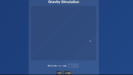

# Gravity Simulation Project

This project is a simple gravity simulation built using React, designed to visually demonstrate how an object falls under the influence of gravity. The simulation allows users to select different celestial bodies (planets and moons) and observe how gravity affects an object’s motion. The velocity, time, and displacement of the falling object are displayed in real-time.


## Features

- **Simulate gravity**: The simulation shows how an object accelerates towards the ground under different gravitational accelerations.
- **Selectable celestial bodies**: Choose from a list of planets and moons, each with its own gravitational acceleration.
- **Real-time velocity, time, and displacement**: Display the current velocity, time elapsed, and displacement of the object as it falls.
- **Responsive and interactive**: The simulation updates in real-time as the object falls.

## Scientific Explanation

This simulation demonstrates the concept of gravitational acceleration, which is the rate at which objects accelerate due to gravity. Gravitational acceleration varies depending on the celestial body (planet or moon) you choose. On Earth, this acceleration is approximately 9.81 m/s².

The key equations used in this simulation are based on Newton's laws of motion:
When the initial velocity is 0,
- **Displacement (position)**:  
  \[
  s = 0.5 . at^2
  \]
  where:
  - \( s \) is the displacement (distance fallen),
  - \( a \) is the acceleration due to gravity,
  - \( t \) is the time elapsed.

- **Velocity**:  
  \[
  v = a.t
  \]
  where:
  - \( v \) is the velocity,
  - \( a \) is the acceleration due to gravity,
  - \( t \) is the time elapsed.

In the simulation, the ball falls under constant acceleration, and its position is updated based on the gravitational acceleration of the selected celestial body. As time progresses, the velocity increases, demonstrating how gravity accelerates the object towards the ground.

## Assumptions

The simulation assumes several ideal conditions for simplicity

- **Constant Gravitational Acceleration**: The object falls under constant acceleration. In reality, gravity may vary slightly with altitude.
- **Neglecting Air Resistance**: Air resistance is ignored in the simulation. In reality, this would slow down the object.
- **Point Mass**: The ball is treated as a point mass, ignoring any effects due to its size or shape.
- **Vertical Motion Only**: The object falls vertically with no horizontal motion or tilt.
- **Instantaneous Start**: The object begins falling immediately from rest.

## Technologies Used

- **React**: Front-end framework used to create the user interface and handle state.
- **CSS**: For styling the application and making it responsive.
- **JavaScript**: For implementing the gravity simulation logic and real-time updates.

## Getting Started

To run this project locally, follow these steps

1. Clone the repository:
   ```bash
   git clone https://github.com/Sanindu/gravity_simulation.git
2. Navigate to the project directory
  ```bash
   cd gravity_simulation
```
3. Install the dependencies
```bash
npm install
```
4. Start the development server
```bash
npm start
```
## Contributing
If you'd like to contribute to this project, feel free to fork the repository and submit a pull request.
